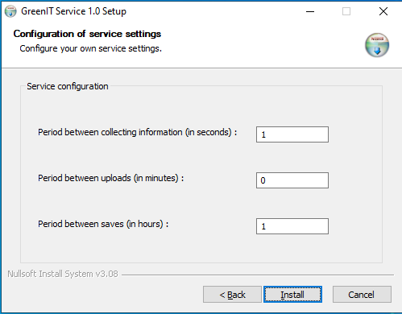

# GreenIT - Server installation

## Introduction
This documentation will show you how to install the GreenIT script and service for client machine.

## Installation

### Plugin
> ***NOTE**: A documentation already exist to install a plugin script. You can go check [here](https://wiki.ocsinventory-ng.org/10.Plugin-engine/Using-plugins-installer/#windows-plugin-deployment)*

### Service
To install it, download the setup of the service [here](https://github.com/OCSInventory-NG/greenit_service/releases/)

## Configuration

### Service configuration
When you start the service setup, you'll get this configuration page:

Here you can configure:
- The period between collecting information is a time in seconds that will allow the service to start colecting information.
    > ***Example** : if you put it to 5, it will collect information every 5 seconds.*

- The period between upload is a time in minutes that will allow the service to write information collected into the data file *(`C:\ProgramData\GreenIT\data.json`)*
    > ***Example** : if you put it to 5, it will write information into data file every 5 minutes. **If you put it to 0, it will write information in data file each data collect.***

    > ***NOTE**: `C:\ProgramData` is an unvisible folder.*

- The period between saves is a time in hours that will allow the service to create a `.bak` file next to data file to don't lose your last data.
    > ***Example** : if you put it to 5, it will create/update the backup file every 5 hours.*

To finish, click on install and don't forget to check `Run GreenIT Service 1.0` at the end.

> ***IMPORTANT NOTE**: It is important to check `Run GreenIT Service 1.0` to install the software as a Windows service !*

If you haven't checked the box, you can install it manually after the install of the software:
- Open a terminal and go in the software installation folder path.
- Run the command `.\GreenIT.exe install` and wait until the plugin is installed.

And it's done :-)
