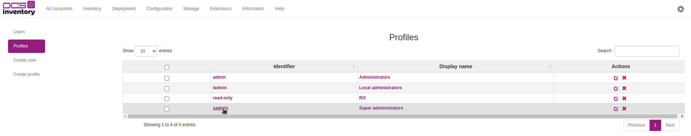
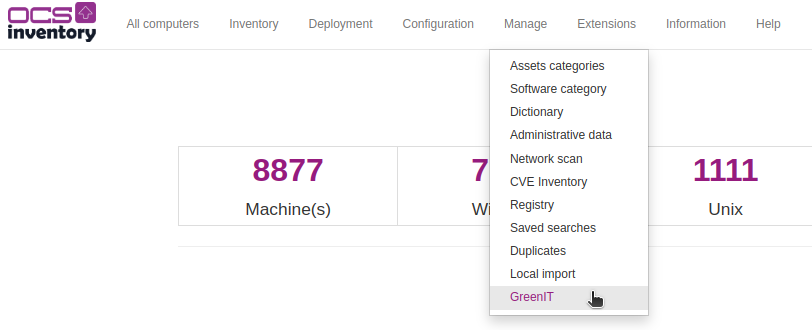

# OCSInventory - GreenIT Plugin

## Prerequisites
The following dependency needs to be installed on your server:
- [Perl module] DateTime.pm

## Server side installation
First, you can download the zip file by clicking [here](https://github.com/PluginsOCSInventory-NG/greenit/releases) and extract to the extensions folder.

> ***NOTE**: The default extension folder of the administration server is:   `/usr/share/ocsinventory-reports/ocsreports/extensions`*

Or you can clone the repository to the extensions folder:   `git clone https://github.com/PluginsOCSInventory-NG/greenit`

Then, install it through the web interface by clicking in the extensions menu then extensions manager.

> ***IMPORTANT NOTE**: Note that if the cloned or the downloaded folder isn't named greenit (case sensitive) the plugin won't be in the extensions list on the web interface.*

To finish, you can click on the install button. It will send you a notification if the plugin is installed without problems.

There is one more step to install your plugin on the server. You'll need to activate the plugin by executing the python script *(install_plugin.py)* in tools folder in OCS-Inventory server folder.

`python3 install_plugin.py`

> ***NOTE**: The default tools folder of the administration server is:   `/usr/share/ocsinventory-reports/ocsreports/tools`*

Activate the plugin with the script and don't forget to restart apache service.

## Client side installation
Inside the plugin folder, there is a PowerShell script *(greenit.ps1)* that needs to be copied in the client plugin folder.

> ***NOTE**: The default PowerShell script folder is:   `greenit/agent/Windows/greenit.ps1`*

> ***NOTE**: The default plugin folder of a client is:   `C:\Program Files (x86)\OCS Inventory Agent\Plugins`*

## Allow access to GreenIT pages
When the plugin is installed, on the web interface you'll have to allow profile to access to two menus.

First, go to the configuration menu, then users:

When you are in this page, go to the left side of your screen and select profiles:

Then choose the profile which can configure and/or see the greenit interface:

To finish, check ms_greenit_config to allow profile to have access to GreenIT configuration page and msg_greenit_dashboard to have access to the GreenIT dashboard:

> ***IMPORTANT NOTE**: Don't forget to save, logout and reconnect to the account.*

## Configuration
To configure the dashboard, you need to have access to the configuration page like we saw it before. When you have the access, go to Manage menu, then GreenIT:

This page will be displayed, from here, you can configure two things:
- the dashboard data
- the API we use to get electricity prices

For the dashboard data, there is:
- Two periods that can be defined   *(Aim to compare with both periods + D-1 period)*
- Two data precision   *(Define how many decimal you want for each data result)*
- Two other data are for the display format.

And for the API data, there is:
- API key   *(If you have subscribed to OCS-Inventory GreenIT offer, you have recived by mail an API key that needs to be written here)*
- Comsumption type   *(There is deferent slice in industry electricity prices, if you don't know what slice you are, keep it at default. if you precise the slice, it will be more accurate during the approximation of the IT cost)*

And it's done :-)
